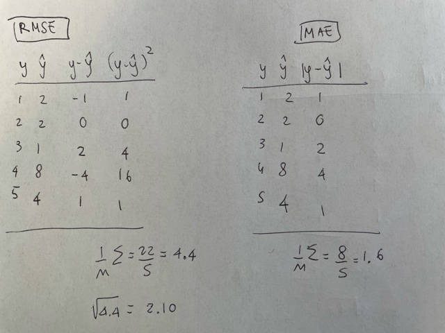
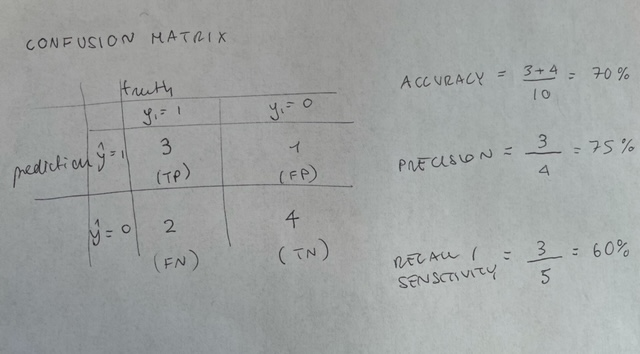

```{r setup, include=FALSE}
knitr::opts_chunk$set(echo = TRUE)
library(tidyverse)
library(haven)
library(tidymodels)
library(purrr)
library(parsnip)
library(rpart.plot)
```

## Question 1

RMSE=2.10
MAE=1.6

Because of the squaring, RMSE penalizes large errors more than MSA does.

```{r rmse}


```

## Question 2

ACCURACY= 70%
PRECISION= 75%
RECALL/SENSITIVITY= 60%

```{r confusion}

```


## Question 3

ACCURACY= 67%
MISSCLASSIFICATION RATE= 34%

```{r multiclass}
knitr::include_graphics("image3.jpg")
```

## Question 4

*Consider a population where it is known that 0.49 of observations have a value of 0 and 0.51 of observations
have a value of 1. Approximately what accuracy can be achieved by simply guessing the same value for all
observations? What number should you predict?*

You would get a 51% accuracy if you guess 1 for all observations and 49 if you guess 0. To maximize accuracy, you would predict 1.

* Consider a population where it is known that 0.99 of observations have a value of 0 and 0.01 of observations
have a value of 1. Approximately what accuracy can be achieved by simply guessing the same value for all
observations? What number should you predict?*

You would get a 1% accuracy if you guess 1 for all observations and 99% if you guess 0. What you want to predict depends on context. If you are maximizing for efficiency, you should predict 0. 

* Explain why it is important to consider context when comparing calculated accuracy in different supervised
machine learning tasks?*
Based on your policy goal, positives, true negatives, false positives, and false negatives carry different costs. This is why it's good to consider other measures other than accuracy, such as sensitivity. In the secodn case for example, it may be very important to predict the 1 right, eveen if that means having a model that has less accuracy. One solution would be to lower the threshold for predicting a 1.

Another point to notice, is that while the second model is performing significantly better, this is not because it's a better model, but simply because the underlying data is skewed towards 0.


## Question 5
1. Divide the marbles data set into a training set with 80% of observations and a testing set 20% of
observations. Set the seed to 20200229 before sampling.
2. Use count() and library(ggplot2) to develop and justify a intuitive/mental model for predicting
black marbles.
3. Construct a custom function that takes a vector of sizes and returns a vector of predicted colors. Apply
it to the testing data. The R4DS chapter on functions is helpful.
4. Construct a custom function that takes y and y_hat that returns calculated accuracy and a confusion
matrix. Until now, we have only returned one object from a custom function. Use list()
inside of return() to return more than one object. Apply it to the data from part 3. Do not use
yardstick::conf_mat() or caret::confusionMatrix().
5. Using the same testing and training data, estimate a decision tree/CART model with functions from
library(parnsip). Use the “rpart” engine.
6. Does the decision tree/CART model generate the same predictions on the testing data as the model
from part 2? Why or why not?

```{r loading}
set.seed(20200229)

# creating a split object
marbles_split <- initial_split(data=marbles_original, prop=0.8)

# create the training and testing data
marbles_train <- training(x = marbles_split)
marbles_test <- testing(x = marbles_split) # putting this to the side

marbles_train_keep <- marbles_train %>%
  mutate(color=as_factor(color)) ## doing this here to keep the original train data for exercise 6

```

We can use a model that predicts black when we have a large sized ball.

```{r model}

marbles_train <- marbles_train %>%
  count(color, size) %>% 
  ggplot(aes(x=size, y=n, fill=color))+
  geom_bar(position = "stack", stat="identity") 


```


```{r function1}

predict_marbles <- function(x) {
  
  marbles_predictions <- case_when(
  x=="big" ~ "black",
  x=="small" ~ "white"
  )

return(marbles_predictions)

}
  
predict_marbles(x=c("big", "small", "small","big")) #works!
 

```

```{r applying_function}

marbles_test <- marbles_test %>%
  mutate(y_hat=predict_marbles(size)) #why using testing data?

```


```{r applying_function}

accuracy_confusion <- function(color, y_hat) {
  
  accuracy <- mean(
  color==y_hat
  )
  
  confusion <-table(
    "pred"=y_hat, "truth"= color
  )

return(list(accuracy, confusion))

}
  
accuracy_confusion(marbles_test$color, marbles_test$y_hat) #testing the function on the testing dataset 

#accuracy us 76% and the confusion matrix is below


```

```{r decision_tree}

cart_mod <- decision_tree() %>%
  set_engine(engine="rpart") %>%
  set_mode(mode="classification")

cart_fit <- cart_mod %>% #fitting the model
  fit(formula= color ~., data=marbles_train_keep) #using the original train data set where color is a factor

rpart.plot::rpart.plot(x=cart_fit$fit) # creating a tree

```

```{r tree_predictions}

tree_predictions <- bind_cols(
  marbles_test,
  predict(cart_fit, marbles_test)
) # predicting on the testing dataset

accuracy_confusion(tree_predictions$color, tree_predictions$.pred_class)

# notice that they are producing the same predictions - 76% accuracy. This is because the tree does the same thing as our custom function, it predicts color based on the size. 

```

## Question 6

```{r data}

# input the data
rats <- tribble(
  ~rat_burrow, ~pizza_distance,
  1, 0.01,
  1, 0.05,
  1, 0.08,
  0, 0.1,
  0, 0.12,
  1, 0.2,
  1, 0.3,
  1, 0.5,
  1, 0.75,
  0, 0.9,
  1, 1,
  0, 1.2,
  0, 2.2,
  0, 2.3,
  0, 2.5,
  1, 3,
  0, 3.5,
  0, 4,
  0, 5,
  0, 7
) %>%
  mutate(rat_burrow = factor(rat_burrow))

# split into training and testing data
split <- initial_split(rats, prop = 0.75)

rats_training <- training(split)

rats_testing <- testing(split)

rats_k1 <- vfold_cv(data = rats_training,
                    v = 3)

rats_k3 <- vfold_cv(data = rats_training,
                    v = 3)

rats_kn <- vfold_cv(data = rats_training,
                    v = 3)
```

```{r k1}

analysis(rats_k1$splits[[1]]) # this is for testing
assessment(rats_k1$splits[[1]]) # this is for training

rats_k1_assessment <- as_tibble(assessment(rats_k1$splits[[1]])) # creating a tibble for assessment

predictions_k1=c(1, 1, 0, 0, 1) #calculating Y hat by hand with k=1

rats_k1_assessment <- bind_cols(
  rats_k1_assessment,
  predictions_k1
) %>%
  rename(...3 = y_hat) ## why cannot rename

knitr::kable(rats_k1_assessment) #generating a table

accuracy_confusion(rats_k1_assessment$rat_burrow, rats_k1_assessment$...3) # only 20% accuracy

```

```{r k3}

analysis(rats_k3$splits[[1]]) # this is for testing
assessment(rats_k3$splits[[1]]) # this is for training

rats_k3_assessment <- as_tibble(assessment(rats_k3$splits[[1]])) # creating a tibble for assessment

predictions_k3=c(0, 0, 0, 0, 0) #calculating Y hat by hand with k=3

rats_k3_assessment <- bind_cols(
  rats_k3_assessment,
  predictions_k3
) %>%
  rename(...3 = y_hat) ## why cannot rename

knitr::kable(rats_k1_assessment) #generating a table

accuracy_confusion(rats_k3_assessment$rat_burrow, rats_k3_assessment$...3) # 80% accuracy

```

```{r kn}

analysis(rats_kn$splits[[1]]) # this is for testing
assessment(rats_kn$splits[[1]]) # this is for training

rats_kn_assessment <- as_tibble(assessment(rats_kn$splits[[1]])) # creating a tibble for assessment

predictions_kn=c(1, 1, 1, 1, 1) #calculating Y hat by hand with k=n

rats_kn_assessment <- bind_cols(
  rats_kn_assessment,
  predictions_kn
) %>%
  rename(...3 = y_hat) ## why cannot rename

knitr::kable(rats_kn_assessment) #generating a table

accuracy_confusion(rats_kn_assessment$rat_burrow, rats_k3_assessment$...3) # 40% accuracy


```

The last was the easiest because we were just taking the majority? Hardest was the first one?

